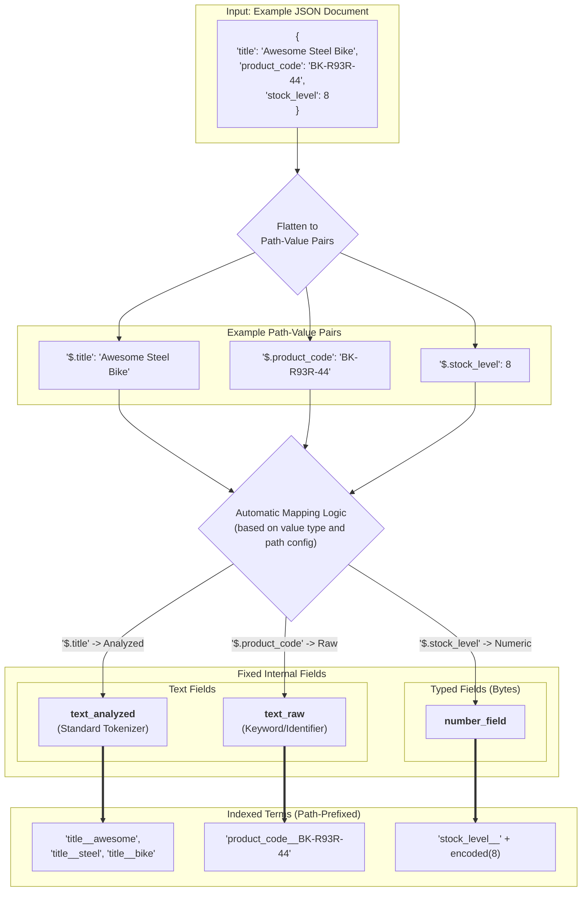
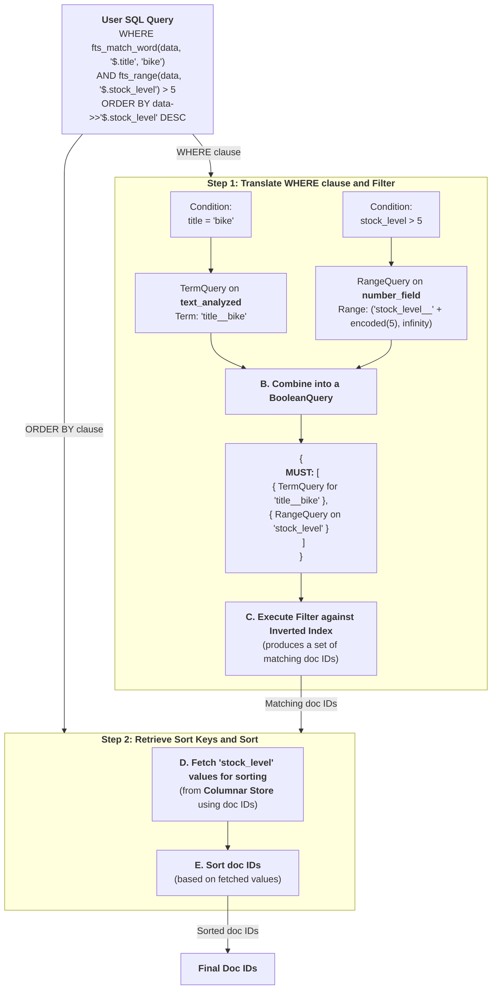
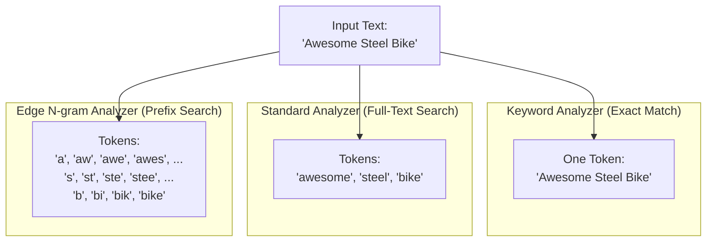

# Native JSON Indexing in TiDB with TiCI

## 1. Executive Summary

For customers accustomed to the search capabilities of systems like Elasticsearch, moving to a powerful distributed SQL database like TiDB presents a dilemma: how do you retain fast, flexible, text-oriented search while gaining the ability to perform complex analytical queries?

We are excited to introduce the next evolution of TiCI: **native JSON indexing and expanded type support**.

Currently, TiCI provides powerful text-search capabilities. In our upcoming version, we are extending this power to structured data. This initiative makes **native JSON support** a headline feature, allowing you to index and query fields within your JSON documents. This enhancement also brings official support for indexing standalone **numeric, date, and boolean types** with the same high performance. The result is a unified system that delivers the best of both worlds: the high-performance search you rely on and the sophisticated SQL analytics you need, all in one place.

This document outlines our proposed design for this transformative feature.

## 2. A Powerful and SQL-Native Query Interface

To provide a clear and powerful interface that feels native to the TiDB/MySQL ecosystem, we will enhance the existing `fts_match` family of functions. These functions act as markers, telling the TiDB query optimizer to delegate the work to TiCI's specialized index, ensuring maximum performance.

### Proposed Functions:

*   `fts_match_word(json_col, path, query_text)`: The primary function for single-term matching.
*   `fts_match_prefix(json_col, path, prefix_text)`: For dedicated prefix matching.
*   `fts_range(json_col, path)`: A marker for accelerating range queries on numeric and date fields. It is used in conjunction with standard SQL operators (`>`, `<`, `BETWEEN`).
*   `fts_exists(json_col, path)`: A boolean function to check if a given JSON path exists and is not `null`.

## 3. Usage and Examples

### 🔨 Table and Index Definition

First, define a `FULLTEXT` index on your `JSON` column. The `COMMENT` clause is used to pass TiCI-specific configuration, such as custom analyzers for different JSON paths.

```sql
CREATE TABLE products (
  id BIGINT PRIMARY KEY,
  data JSON,
  FULLTEXT INDEX idx_product_data (data) COMMENT 'tici:{
    "default_analyzer": "standard",
    "path_configs": [
      {"path": "$.product_code", "analyzer": "keyword"},
      {"path": "$.title", "analyzer": "english_stemmer"}
    ]
  }'
);
```

### 🔍 Example JSON Document

```json
{
  "title": "Awesome Steel Bike",
  "product_code": "BK-R93R-44",
  "stock_level": 8
}
```

### 🔍 Query Examples

#### 1. Text Search with Sorting and Filtering

Find products matching "bike" with a stock level greater than 5, and order by stock level.
The `WHERE` and `ORDER BY` clauses are both accelerated by TiCI.

```sql
SELECT id, data->>'$.title', data->>'$.stock_level'
FROM products
WHERE fts_match_word(data, '$.title', 'bike')
  AND fts_range(data, '$.stock_level') > 5
ORDER BY data->>'$.stock_level' DESC;
```

#### 2. Exact Match

Find products with a specific product code.

```sql
SELECT * FROM products
WHERE fts_match_word(data, '$.product_code', 'BK-R93R-44');
```

#### 3. Checking for Field Existence

Find products where the `product_code` field exists and is not null.

```sql
SELECT * FROM products
WHERE fts_exists(data, '$.product_code');
```

---

## 4. Under the Hood: The Internal Design

### The Indexing Pipeline

TiCI processes JSON by flattening it into path-value pairs. Based on your configuration, it applies specific analyzers to each path, converting values into indexed terms for fast retrieval. This indexing process is the key to accelerating queries on all data types.

**Diagram A: The Indexing Pipeline**


### The Query Execution Pipeline

When you run a query using `fts_*` functions, the TiDB optimizer recognizes them and rewrites the plan to delegate the filtering work to TiCI. **Crucially, this includes range filters and sorting**, which are executed efficiently on the TiCI index, not on the TiDB level.

**Diagram B: The Query Pipeline**


### Understanding Analyzers

The choice of analyzer is critical for defining *how* a field can be searched. For example, if you want to perform prefix matching on phone numbers, you should choose the `edge_ngram` tokenizer and use `fts_match_word` when querying.

**Diagram C: Analyzer Comparison for "Awesome Steel Bike"**


### High-Performance Sorting on JSON: A Technical Deep-Dive

While filtering on JSON fields is straightforward, sorting (`ORDER BY`) introduces a unique performance challenge that requires a specific solution.

**The Challenge: Dynamic vs. Static Fields**

At its core, TiCI's inverted index is designed for incredibly fast filtering. It can quickly find all documents that contain a specific value (e.g., `product_code = 'BK-R93R-44'`). However, sorting requires a different access pattern. To sort results, the system needs to look up the value of the `ORDER BY` field for *every document* that matches the `WHERE` clause.

When sorting by a top-level TiDB column (e.g., `ORDER BY id`), this is extremely fast. But with JSON, the field being sorted on (`data->>'$.stock_level'`) is just one of potentially hundreds of different keys within a single JSON object.

Because all these different JSON paths and values are indexed together, finding the specific value for `stock_level` for a given document requires an inefficient scan-and-check process for each row in the result set. This can significantly slow down queries on large datasets.

**The Solutions: Explicit Configuration for Optimal Performance**

To guarantee the high-speed sorting that users expect, we provide two robust solutions. Both approaches work by moving the sort key out of the dynamic JSON structure and into a dedicated, optimized field.

**1. Recommended: Explicitly Configure Sortable Fields in TiCI**

The most powerful and recommended approach is to tell TiCI which JSON fields you intend to sort by. You can do this with a `sortable_fields` configuration in the `COMMENT` of your index definition.

```sql
CREATE TABLE products (
  id BIGINT PRIMARY KEY,
  data JSON,
  FULLTEXT INDEX idx_product_data (data) COMMENT 'tici:{
    ... -- other configs
    "sortable_fields": {
      "stock": {"path": "$.stock_level", "type": "f64"},
      "release_date": {"path": "$.release_date", "type": "datetime"}
    }
  }'
);
```

**How it Works:**
When you declare a field as "sortable," TiCI creates a dedicated, high-performance columnar storage for just that field behind the scenes. When you run a query with `ORDER BY data->>'$.stock_level'`, TiCI automatically uses this optimized storage, resulting in extremely fast sorting performance that is on par with sorting on a native TiDB column.

**2. Alternative: Use Generated Columns in TiDB**

If you prefer to manage schema at the TiDB level, you can use a standard `GENERATED ALWAYS AS` column to extract the sortable field from the JSON.

```sql
ALTER TABLE products ADD COLUMN stock_level_generated BIGINT
  AS (data->>'$.stock_level') STORED;

-- Create a standard TiDB index for sorting
CREATE INDEX idx_stock_level on products(stock_level_generated);
```

**How it Works:**
With this approach, you simply use the generated column in your `ORDER BY` clause. TiDB will use its standard B-Tree index to provide efficient sorting.

```sql
SELECT id, data->>'$.title'
FROM products
WHERE fts_match_word(data, '$.title', 'bike')
ORDER BY stock_level_generated DESC;
```

By requiring this explicit configuration, we ensure that every `ORDER BY` operation on a JSON field is a high-performance operation, avoiding unexpected slowdowns and providing a predictable, scalable solution.

## 5. Design Considerations (Current Limitations)

*   **Flattened Data Model**: The index "flattens" arrays of objects. This means parent-child relationships within a nested structure are not preserved in the index, which can lead to false positives when querying across multiple fields of a nested object. For example, if you have `variants: [{color: "red", size: "L"}, {color: "blue", size: "M"}]`, a query for `color: "red" AND size: "M"` would match.

*   **Static Type Inference**: The type of a field (e.g., text, number) is inferred during the first ingestion and remains fixed. A field that contains both `"123"` and `123` will be treated as either text or numeric based on the first value seen, and subsequent documents must conform.

*   **No Phrase Matching**: The initial version will support single-term matching via `fts_match_word`. Support for multi-term phrase queries is planned for a future release.

*   **No Relevance-Based Scoring**: Queries are based on boolean matching, not relevance scoring. There is no support for ordering results by a relevance score like TF-IDF or BM25. 