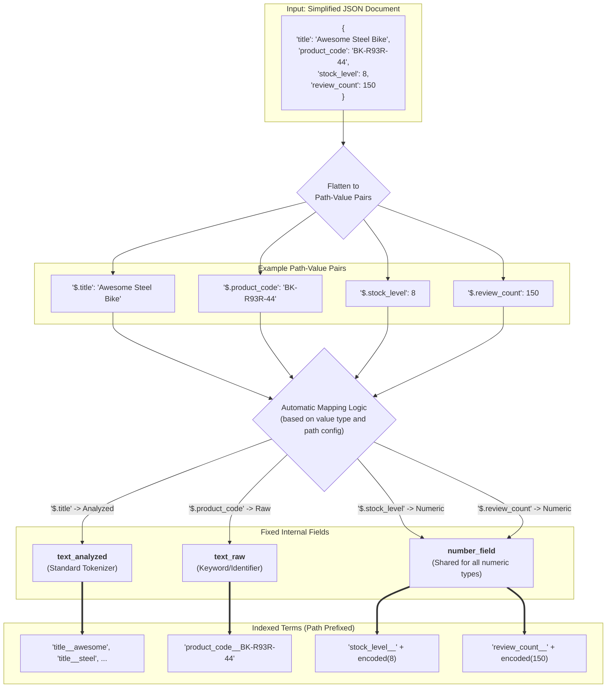
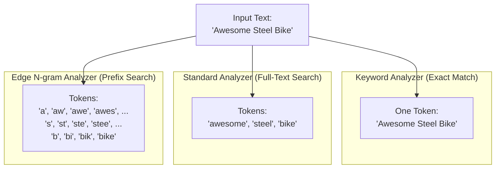

# Native JSON Indexing in TiDB with TiCI

## 1. Executive Summary

For customers accustomed to the search capabilities of systems like Elasticsearch, moving to a powerful distributed SQL database like TiDB presents a dilemma: how do you retain fast, flexible, text-oriented search while gaining the ability to perform complex analytical queries?

We are excited to introduce the next evolution of TiCI: **native JSON indexing and expanded type support**.

Currently, TiCI provides powerful text-search capabilities. In our upcoming version, we are extending this power to structured data. This initiative makes **native JSON support** a headline feature, allowing you to index and query fields within your JSON documents. This enhancement also brings official support for indexing standalone **numeric, date, and boolean types** with the same high performance. The result is a unified system that delivers the best of both worlds: the high-performance search you rely on and the sophisticated SQL analytics you need, all in one place.

This document outlines our proposed design for this transformative feature.

## 2. A Powerful and SQL-Native Query Interface

To provide a clear and powerful interface that feels native to the TiDB/MySQL ecosystem, we will enhance the existing `fts_match` family of functions. These functions act as markers, telling the TiDB query optimizer to delegate the work to TiCI's specialized index, ensuring maximum performance.

### Proposed Functions:

*   `fts_match_word(json_col, path, query_text)`: The primary function for single-term matching.
*   `fts_range(json_col, path)`: A marker for accelerating range queries on numeric and date fields. It is used in conjunction with standard SQL operators (`>`, `<`, `BETWEEN`).
*   `fts_exists(json_col, path)`: A boolean function to check if a given JSON path exists and is not `null`.

## 3. Usage and Examples

### 🔨 Table and Index Definition

First, create your table, and then add a `FULLTEXT` index on the `JSON` column. The `PARAMETER` clause is used to pass TiCI-specific configuration, such as custom analyzers for different JSON paths.

```sql
CREATE TABLE products (
  id BIGINT PRIMARY KEY,
  data JSON
);

ALTER TABLE products ADD FULLTEXT INDEX idx_product_data (data) PARAMETER 'tici:{
  "default_analyzer": "standard",
  "path_configs": [
    {"path": "$.product_code", "analyzer": "keyword"},
    {"path": "$.title", "analyzer": "english_stemmer"},
    {"path": "$.phone_numbers[*]", "analyzer": "edge_ngram_3_10"}
  ]
}';
```

### 🔍 Example JSON Document

```json
{
  "title": "Awesome Steel Bike",
  "product_code": "BK-R93R-44",
  "stock_level": 8,
  "on_sale": true,
  "tags": ["bicycle", "sports", "outdoors"],
  "phone_numbers": ["13812345678", "15987654321"],
  "release_date": "2023-05-01T10:00:00Z"
}
```

### 🔍 Query Examples

#### 1. Text Search with Sorting and Pagination

Find products matching "bike", order by release date, and return the top 10. The `ORDER BY` on `release_date` is accelerated by TiCI.

```sql
SELECT id, data->>'$.title'
FROM products
WHERE fts_match_word(data, '$.title', 'bike')
ORDER BY data->>'$.release_date' DESC
LIMIT 10;
```

#### 2. Combined Exact Match and Range Filter

Find bikes in stock that are not on sale. Both conditions are pushed down to TiCI.

```sql
SELECT * FROM products
WHERE fts_match_word(data, '$.on_sale', 'false')
  AND fts_range(data, '$.stock_level') > 0;
```

#### 3. Searching within an Array (`NOT IN` equivalent)

Find products tagged "sports" but not "outdoors".

```sql
SELECT * FROM products
WHERE fts_match_word(data, '$.tags', 'sports')
  AND NOT fts_match_word(data, '$.tags', 'outdoors');
```

#### 4. Checking for Field Existence

Find products where the `product_code` field exists and is not null.

```sql
SELECT * FROM products
WHERE fts_exists(data, '$.product_code');
```

#### 5. Complex Combined Query

Find outdoor products that are on sale, have a stock level between 5 and 20, and have a `product_code` of "BK-R93R-44". Order the results by most recently released.

```sql
SELECT id, data->>'$.title', data->>'$.stock_level'
FROM products
WHERE
  fts_match_word(data, '$.tags', 'outdoors')
  AND fts_match_word(data, '$.on_sale', 'true')
  AND fts_match_word(data, '$.product_code', 'BK-R93R-44')
  AND fts_range(data, '$.stock_level') BETWEEN 5 AND 20
ORDER BY data->>'$.release_date' DESC;
```

---

## 4. Under the Hood: The Internal Design

### The Indexing Pipeline

TiCI processes JSON by flattening it into path-value pairs. For paths explicitly defined in your `path_configs`, TiCI applies the specified analyzer. For all other paths, it uses a default analyzer based on the value's data type (e.g., standard tokenizer for text, keyword for identifiers).

To distinguish between different keys that map to the same internal field (e.g., all numbers map to a single `number_field`), TiCI automatically **encodes the JSON path as a prefix to the indexed value**. This is the key mechanism that allows filtering on any arbitrary path.

For the diagrams below, we will use a simplified JSON document to illustrate the core concepts clearly.

**Simplified JSON for Diagrams:**
```json
{
  "title": "Awesome Steel Bike",
  "product_code": "BK-R93R-44",
  "stock_level": 8,
  "review_count": 150
}
```

**Diagram A: The Indexing Pipeline**


### The Query Execution Pipeline

When you run a query using `fts_*` functions, the TiDB optimizer recognizes them and rewrites the plan to delegate the filtering work to TiCI. **Crucially, this includes range filters and sorting**, which are executed efficiently on the TiCI index, not on the TiDB level.

**Diagram B: The Query Pipeline**


### Understanding Analyzers

The choice of analyzer is critical for defining *how* a field can be searched. For example, if you want to perform prefix matching on phone numbers, you should choose the `edge_ngram` tokenizer and use `fts_match_word` when querying.

**Diagram C: Analyzer Comparison for "Awesome Steel Bike"**


### High-Performance Sorting on JSON: A Technical Deep-Dive

While filtering on JSON fields is straightforward, sorting (`ORDER BY`) introduces a unique performance challenge that requires a specific solution.

**The Challenge: Dynamic vs. Static Fields**

To provide flexibility, TiCI maps all JSON paths of the same data type (e.g., all numbers, all strings) into a single, shared internal field. This is highly efficient for filtering. However, when sorting on a specific JSON field (e.g., `ORDER BY data->>'$.stock_level'`), the system must scan through all the numeric values within each document to find the correct one for `stock_level`. This scan-and-check process for every matched row can slow down queries on large datasets.

**The Solutions: Explicit Configuration for Optimal Performance**

To guarantee the high-speed sorting that users expect, we provide two robust solutions. Both approaches work by moving the sort key out of the dynamic, shared internal field and into a dedicated, optimized structure.

**1. Recommended: Explicitly Configure Sortable Fields in TiCI**

The most powerful and recommended approach is to tell TiCI which JSON fields you intend to sort by. You can do this with a `sortable_fields` configuration in the `PARAMETER` of your index definition.

```sql
CREATE TABLE products (
  id BIGINT PRIMARY KEY,
  data JSON,
  FULLTEXT INDEX idx_product_data (data) PARAMETER 'tici:{
    ... -- other configs
    "sortable_fields": {
      "stock": {"path": "$.stock_level", "type": "f64"},
      "release_date": {"path": "$.release_date", "type": "datetime"}
    }
  }'
);
```

**How it Works:**
When you declare a field as "sortable," TiCI creates a dedicated, high-performance columnar storage (a "fast field") for just that field behind the scenes. The raw value is stored directly in this field **without any path prefix encoding.** When you run a query with `ORDER BY data->>'$.stock_level'`, TiCI automatically uses this optimized storage, resulting in extremely fast sorting performance.

**2. Alternative: Use Generated Columns**

If you prefer to manage schema at the TiDB level, you can use a standard `GENERATED ALWAYS AS` column to extract the sortable field from the JSON. You must then include this generated column in your `FULLTEXT` index definition.

```sql
ALTER TABLE products ADD COLUMN stock_level_generated BIGINT
  AS (data->>'$.stock_level') STORED;

-- The generated column MUST be included in the FTS index
ALTER TABLE products ADD FULLTEXT INDEX idx_product_data_with_sort (data, stock_level_generated);
```

**How it Works:**
When the generated column is part of the `FULLTEXT` index, TiCI automatically creates a dedicated fast field for it, just as it does for `sortable_fields`. When you `ORDER BY stock_level_generated`, TiCI leverages this dedicated fast field for high-performance sorting.

```sql
SELECT id, data->>'$.title'
FROM products
WHERE fts_match_word(data, '$.title', 'bike')
ORDER BY stock_level_generated DESC;
```

By requiring this explicit configuration, we ensure that every `ORDER BY` operation on a JSON field is a high-performance operation, avoiding unexpected slowdowns and providing a predictable, scalable solution.

## 5. Design Considerations (Current Limitations)

*   **Flattened Data Model**: The index "flattens" arrays of objects. This means parent-child relationships within a nested structure are not preserved in the index, which can lead to false positives when querying across multiple fields of a nested object. For example, if you have `variants: [{color: "red", size: "L"}, {color: "blue", size: "M"}]`, a query for `color: "red" AND size: "M"` would match.

*   **Dynamic Typing**: TiCI embraces the flexibility of JSON. The type of a field is determined on a per-document basis. This means a given JSON path (e.g., `$.user_id`) can contain a number in one document (`12345`) and a string in another (`"user-abc"`). TiCI indexes each value according to its actual type. Queries for a specific type (e.g., a range query on numbers) will only consider documents where the path contains a matching type and will ignore others, without performing any automatic type conversion.

*   **No Phrase Matching**: The initial version will support single-term matching via `fts_match_word`. Support for multi-term phrase queries is planned for a future release.

*   **No Relevance-Based Scoring**: Queries are based on boolean matching, not relevance scoring. There is no support for ordering results by a relevance score like TF-IDF or BM25. 