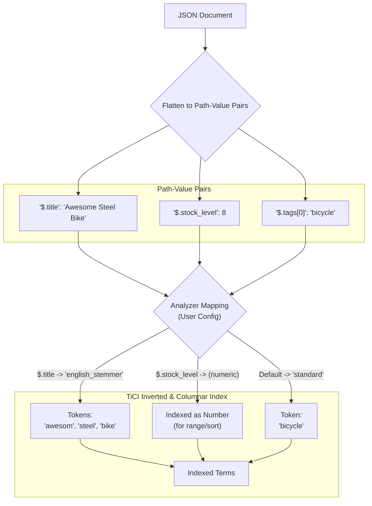
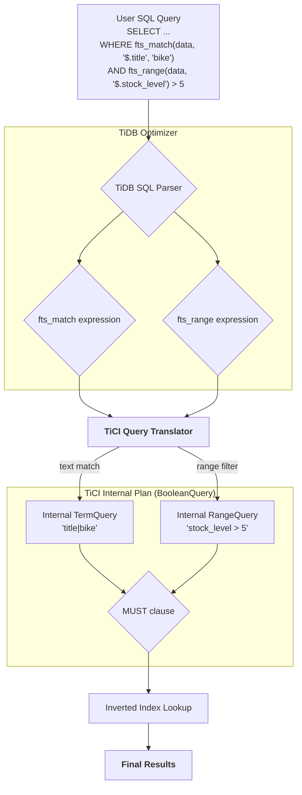
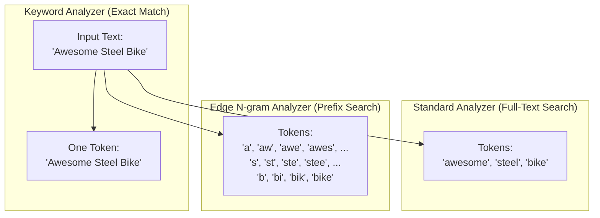

# The Best of Both Worlds: High-Performance Search Meets Advanced SQL in TiDB with TiCI

## 1. Executive Summary

For customers accustomed to the search capabilities of systems like Elasticsearch, moving to a powerful distributed SQL database like TiDB presents a dilemma: how do you retain fast, flexible, text-oriented search while gaining the ability to perform complex analytical queries?

We are excited to introduce the answer: **native JSON indexing in TiCI**.

This feature is designed specifically for you. It extends TiCI's powerful indexing capabilities—which already support text, numeric, date, boolean, and array types—to the fields within your JSON documents. The result is a unified system that delivers the best of both worlds: the high-performance search you rely on and the sophisticated SQL analytics you need, all in one place.

This document outlines our proposed design for this transformative feature.

## 2. A Powerful and SQL-Native Query Interface

To provide a clear and powerful interface that feels native to the TiDB/MySQL ecosystem, we will enhance the existing `fts_match` family of functions. These functions act as markers, telling the TiDB query optimizer to delegate the work to TiCI's specialized index, ensuring maximum performance.

### Proposed Functions:

*   `fts_match(json_col, path, query_text)`: The primary function for term and phrase matching.
*   `fts_match_prefix(json_col, path, prefix_text)`: For dedicated prefix matching.
*   `fts_range(json_col, path)`: A marker for accelerating range queries on numeric and date fields. It is used in conjunction with standard SQL operators (`>`, `<`, `BETWEEN`).
*   `fts_exists(json_col, path)`: A boolean function to check if a given JSON path exists and is not `null`.

## 3. Usage and Examples

### 🔨 Table and Index Definition

First, define a `FULLTEXT` index on your `JSON` column. The `COMMENT` clause is used to pass TiCI-specific configuration, such as custom analyzers for different JSON paths.

```sql
CREATE TABLE products (
  id BIGINT PRIMARY KEY,
  data JSON,
  FULLTEXT INDEX idx_product_data (data) COMMENT 'tici:{
    "default_analyzer": "standard",
    "path_configs": [
      {"path": "$.product_code", "analyzer": "keyword"},
      {"path": "$.title", "analyzer": "english_stemmer"},
      {"path": "$.phone_numbers[*]", "analyzer": "edge_ngram_3_10"}
    ]
  }'
);
```

### 🔍 Example JSON Document

```json
{
  "title": "Awesome Steel Bike",
  "product_code": "BK-R93R-44",
  "stock_level": 8,
  "on_sale": true,
  "tags": ["bicycle", "sports", "outdoors"],
  "phone_numbers": ["13812345678", "15987654321"],
  "release_date": "2023-05-01T10:00:00Z"
}
```

### 🔍 Query Examples

#### 1. Text Search with Sorting and Pagination

Find products matching "bike", order by release date, and return the top 10. The `ORDER BY` on `release_date` is accelerated by TiCI.

```sql
SELECT id, data->>'$.title'
FROM products
WHERE fts_match(data, '$.title', 'bike')
ORDER BY data->>'$.release_date' DESC
LIMIT 10;
```

#### 2. Combined Exact Match and Range Filter

Find bikes in stock that are not on sale. Both conditions are pushed down to TiCI.

```sql
SELECT * FROM products
WHERE fts_match(data, '$.on_sale', 'false')
  AND fts_range(data, '$.stock_level') > 0;
```

#### 3. Searching within an Array (`NOT IN` equivalent)

Find products tagged "sports" but not "outdoors".

```sql
SELECT * FROM products
WHERE fts_match(data, '$.tags', 'sports')
  AND NOT fts_match(data, '$.tags', 'outdoors');
```

#### 4. Checking for NULL values

Find products where the `product_code` field exists and is not null.

```sql
SELECT * FROM products
WHERE fts_exists(data, '$.product_code');
```

#### 5. Prefix Search on an Array of Strings

Find a product by the prefix of a phone number.

```sql
SELECT * FROM products
WHERE fts_match_prefix(data, '$.phone_numbers', '138123');
```

---

## 4. Under the Hood: The Internal Design

### The Indexing Pipeline

TiCI processes JSON by flattening it into path-value pairs. Based on your configuration, it applies specific analyzers to each path, converting values into indexed terms for fast retrieval. This indexing process is the key to accelerating queries on all data types.

**Diagram A: The Indexing Pipeline**


### The Query Execution Pipeline

When you run a query using `fts_*` functions, the TiDB optimizer recognizes them and rewrites the plan to delegate the filtering work to TiCI. **Crucially, this includes range filters and sorting**, which are executed efficiently on the TiCI index, not on the TiDB level.

**Diagram B: The Query Pipeline**


### Understanding Analyzers

The choice of analyzer is critical for defining *how* a field can be searched.

**Diagram C: Analyzer Comparison for "Awesome Steel Bike"**


### Indexing for Performance: Beyond Text

For numeric, date, and boolean fields, TiCI does more than just create searchable terms. These values are stored in a highly optimized columnar format similar to a B-Tree. This structure allows TiCI to perform two operations with extreme speed:
*   **Exact Matches**: Finding a specific value (e.g., `stock_level = 8`).
*   **Range Scans**: Efficiently retrieving all documents within a range (e.g., `stock_level > 5`).

This is why `fts_range` and sorting operations on these fields are significantly faster than full table scans in TiDB.

## 5. Design Considerations (Current Limitations)

*   **Flattened Data Model**: The index "flattens" arrays of objects. This means parent-child relationships within a nested structure are not preserved in the index, which can lead to false positives when querying across multiple fields of a nested object. For example, if you have `variants: [{color: "red", size: "L"}, {color: "blue", size: "M"}]`, a query for `color: "red" AND size: "M"` would match.

*   **Static Type Inference**: The type of a field (e.g., text, number) is inferred during the first ingestion and remains fixed. A field that contains both `"123"` and `123` will be treated as either text or numeric based on the first value seen, and subsequent documents must conform. 